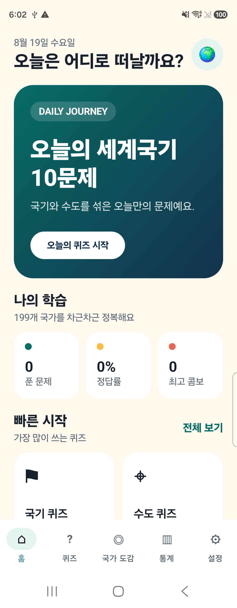
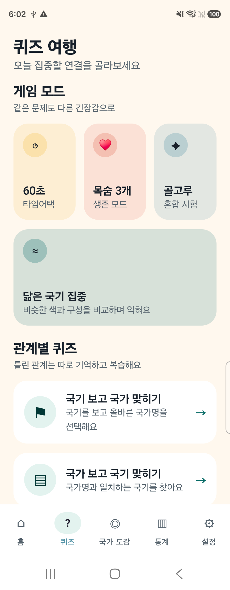
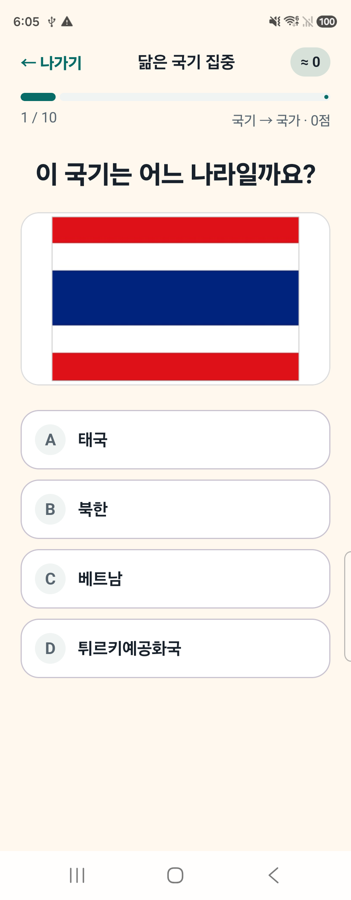
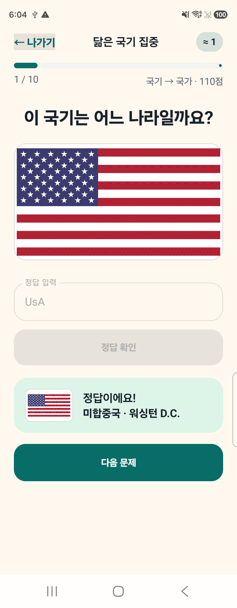
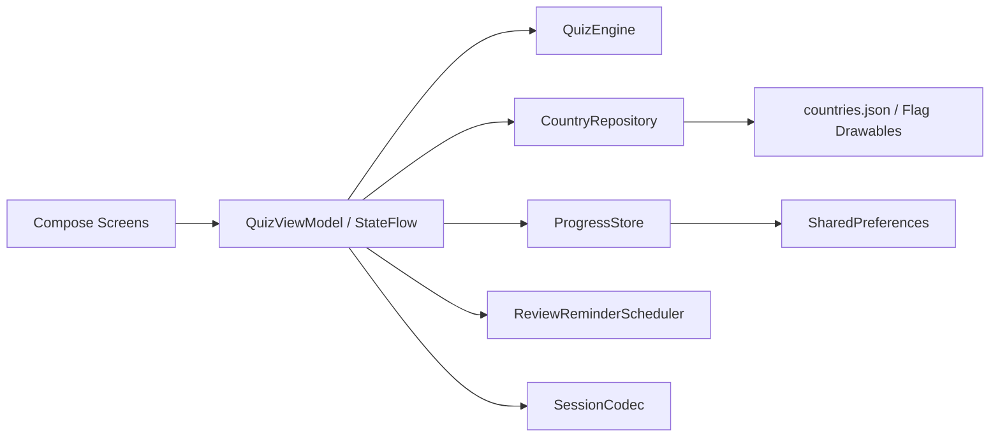

# 🌍 세계국기 수도퀴즈

<p align="center">
  공공데이터 기반으로 199개 국가·지역의 국기와 수도를 학습하는<br />
  <strong>오프라인 Android 퀴즈 애플리케이션</strong>
</p>

<p align="center">
  
  
  
  
</p>

## 프로젝트 소개

국기와 수도를 단순히 한 방향으로 암기하는 대신, **국기·국가·수도의 관계를 여러 방향으로 반복 학습**할 수 있도록 만든 앱입니다. 외교부 공공데이터를 빌드 시점에 정제해 앱에 포함하며, 퀴즈 실행 중에는 네트워크나 API 인증키가 필요하지 않습니다.

선택형뿐 아니라 한글·영문 주관식, 유사 국기 집중 훈련, 오답 기반 간격 복습, 세션 복구를 지원해 짧은 게임성과 지속적인 학습 경험을 함께 제공하는 것을 목표로 했습니다.

| 구분 | 내용 |
| --- | --- |
| 플랫폼 | Android 12(API 31) 이상 |
| 수록 범위 | 199개 국가·지역 및 국기 |
| UI | Jetpack Compose + Material 3 |
| 데이터 처리 | 공공 API 동기화 후 JSON·Drawable 로컬 번들링 |
| 실행 방식 | 완전 오프라인 |

## 문제 정의와 해결

| 문제 | 해결 방식 |
| --- | --- |
| 한 방향 암기로는 국가·국기·수도의 연결이 쉽게 끊김 | 동일 데이터를 7가지 관계형 문제와 혼합 퀴즈로 재구성 |
| 유사한 국기를 일반 오답과 함께 보면 변별 학습이 어려움 | `FlagSimilarity` 그룹을 활용해 시각적으로 비슷한 국기를 우선 출제 |
| 띄어쓰기나 영문 표기 차이 때문에 주관식 정답이 오답 처리됨 | Unicode 정규화와 한·영문 별칭 목록을 결합한 정확 일치 판정 |
| 앱 종료 시 진행 중인 퀴즈가 사라짐 | 질문·답변·점수·타이머를 직렬화해 세션 전체 복원 |
| 공공 API 장애나 호출 한도가 학습 경험에 영향을 줌 | 데이터를 빌드 시점에 동기화하고 런타임은 완전 오프라인으로 구성 |

## 주요 화면

<table>
  <tr>
    <th>홈</th>
    <th>모드 선택</th>
    <th>닮은 국기</th>
    <th>주관식 정답</th>
  </tr>
  <tr>
    <td></td>
    <td></td>
    <td></td>
    <td></td>
  </tr>
</table>

## 핵심 기능

- **다방향 퀴즈**: 국기→국가, 국가→국기, 국가→수도, 수도→국가, 국기→수도, OX, 혼합 퀴즈
- **다양한 게임 방식**: 기본, 60초 타임어택, 생존, 데일리, 오답 복습, 닮은 국기 집중
- **선택형·주관식 전환**: 한글과 영어 국가명·수도명 및 등록된 별칭을 모두 정답으로 처리
- **유사 국기 오답 생성**: 색상과 구성이 비슷한 국가를 우선 배치해 변별 학습 강화
- **간격 반복 복습**: 학습 결과에 따라 1·3·7·14·30·60일 간격으로 다음 복습 시점 계산
- **로컬 복습 알림**: 복습할 문제가 있을 때 매일 오전 9시에 알림 예약
- **진행 상황 저장**: 관계별 정답률, 숙련도, 오답 횟수, 즐겨찾기, 최고 콤보 기록
- **세션 복구**: 프로세스 종료 후에도 문제 순서, 선택 답안, 점수, 타이머 상태 복원

## 기술적 구현

### 1. 공통 퀴즈 엔진

`QuizEngine`이 지역, 난이도, 문제 수, 답변 방식과 게임 모드를 조합해 모든 문제를 생성합니다. 화면은 생성 규칙을 알 필요 없이 `QuizQuestion`만 렌더링하므로 새로운 모드를 추가할 때 UI 변경 범위를 줄였습니다.

### 2. 유연한 주관식 판정

`AnswerNormalizer`는 Unicode NFKD 정규화 후 대소문자, 공백, 문장부호, 라틴 악센트를 제거합니다. `USA`, `UsA`, `U.S.A.`처럼 표현이 달라도 등록된 별칭과 정규화 결과가 같으면 정답으로 인정하되 부분 문자열은 허용하지 않습니다.

### 3. 학습 상태와 세션 분리

누적 학습 기록은 `ProgressStore`, 진행 중인 문제는 `SessionCodec`이 담당합니다. 질문과 답변 전체를 JSON으로 직렬화해 앱 재시작 시에도 동일한 세션을 복원합니다.

### 4. 오프라인 데이터 파이프라인

`tools/Sync-CountryData.ps1`이 외교부 API 결과와 국기 리소스를 ISO 코드로 결합하고, 수도 별칭과 난이도를 보정한 뒤 아래 파일을 생성합니다.

- `app/src/main/assets/countries.json`
- `app/src/main/java/com/chlqudco/countryquiz/data/FlagResources.kt`

인증키와 API 주소는 런타임 앱에 포함되지 않으며 APK에는 `INTERNET` 권한도 선언하지 않습니다.

## 아키텍처



단일 Activity 위에서 `StateFlow` 기반 단방향 상태 흐름을 사용합니다. 별도 내비게이션 프레임워크 없이 `AppScreen` 상태로 화면 전환을 제어해 현재 규모에서 흐름을 단순하게 유지했습니다.

## 기술 스택

| 영역 | 기술 |
| --- | --- |
| Language | Kotlin 2.2.10, Java 11 bytecode target |
| UI | Jetpack Compose, Material 3 |
| State | AndroidViewModel, StateFlow |
| Persistence | SharedPreferences, JSON serialization |
| Background | AlarmManager, BroadcastReceiver, NotificationCompat |
| Data | 외교부 공공 API, 로컬 JSON·Drawable |
| Test | JUnit 4, AndroidX Test, Espresso |
| Build | Gradle Kotlin DSL, AGP 9.2.1 |

## 프로젝트 구조

```text
app/src/main/
├─ assets/                 # 정제된 국가·수도 데이터
├─ java/.../countryquiz/
│  ├─ data/                # Repository, 저장소, 세션 Codec
│  ├─ model/               # 도메인 및 UI 상태 모델
│  ├─ notification/        # 복습 알림 예약
│  ├─ quiz/                # 문제 생성, 정답 판정, 유사 국기 규칙
│  └─ ui/                  # Compose 화면, 컴포넌트, ViewModel
└─ res/drawable-nodpi/     # ISO 코드 기반 국기 이미지

app/src/test/              # JVM 단위 테스트
app/src/androidTest/       # 실기기 계측 테스트
tools/                     # 공공데이터 동기화 스크립트
```

## 실행 방법

### 요구 환경

- Android Studio 및 Android SDK 37
- JDK 17 이상 또는 Android Studio 내장 JBR
- Android 12(API 31) 이상의 에뮬레이터 또는 기기

```powershell
# 디버그 APK 빌드
.\gradlew.bat :app:assembleDebug

# JVM 테스트
.\gradlew.bat :app:testDebugUnitTest

# Android Lint
.\gradlew.bat :app:lintDebug

# 연결된 기기에서 계측 테스트
.\gradlew.bat :app:connectedDebugAndroidTest
```

빌드 결과는 `app/build/outputs/apk/debug/app-debug.apk`에서 확인할 수 있습니다.

### 국가 데이터 갱신

일반 빌드에는 인증키가 필요하지 않습니다. 데이터 갱신 시에만 `local.properties`에 공공데이터포털 인증키를 추가합니다.

```properties
DATA_GO_KR_SERVICE_KEY=발급받은_인증키
```

```powershell
.\tools\Sync-CountryData.ps1
```

`local.properties`와 인증키는 저장소에 커밋하지 않습니다.

## 테스트 및 품질

최근 검증 기준:

- JVM 단위 테스트 **11개 통과**
- Android 실기기 테스트 **3개 통과**
- 199개 국가 ISO 코드·수도·국기 리소스 무결성 확인
- 199개 국기 Drawable 실기기 디코딩 확인
- 주관식 정규화 및 세션 직렬화 회귀 테스트
- Android Lint **오류 0개**
- SM-F946N / Android 16에서 주요 화면과 알림 예약 검증

## 데이터 출처

- [외교부 「국가·지역별 일반사항」 공공 API](https://www.data.go.kr/data/15099534/openapi.do)
- 외교부 국가(지역)별 국기 이미지 공개데이터
- 대한민국·북한·대만 국가·수도 정보는 별도 보완하고, 세 국기는 Flagpedia(flagcdn.com) 공개 이미지 사용

본 앱은 외교부가 제작하거나 공식 인증한 애플리케이션이 아닙니다.

## 개선 계획

- SharedPreferences 기반 학습 기록을 Room으로 마이그레이션
- GIF 국기 리소스를 WebP로 변환해 APK 용량 최적화
- 정식 앱 아이콘·스플래시 및 Release 서명 구성
- 국가 상세 정보와 지도 기반 학습 확장
- 선택적 클라우드 동기화 및 다중 기기 지원
